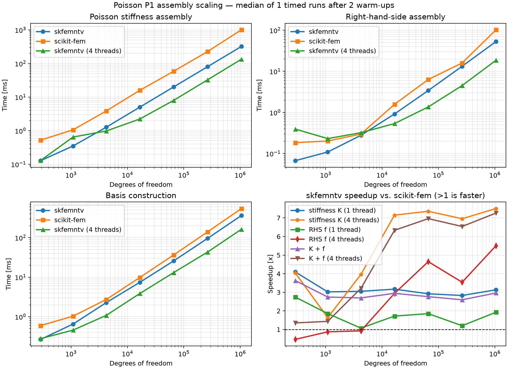

# Poisson assembly scaling

This benchmark compares native `skfemntv` assembly with scikit-fem while growing a
structured triangular mesh.  Both implementations receive exactly the same
coordinates, connectivity, P1 space, and integration order.  It measures:

- basis construction;
- Poisson stiffness-matrix assembly;
- constant right-hand-side assembly.

Linear-system solution is deliberately excluded: `skfemntv` is an assembly engine,
and both packages can pass the resulting CSR matrix to the same solver.

Here, basis construction means the one-time preparation of the global DOF map,
quadrature data, tabulated shape values and gradients, element Jacobians, and
physical quadrature coordinates.  It is not paid again when the same `Basis`
is reused across repeated assembly calls.

`official_performance.py` follows scikit-fem's official Tet P1
`docs/examples/performance.py`.  It preserves the official `k=6..20` mesh
sequence and reports both Basis-inclusive cold assembly and Basis-reusing warm
assembly:

```bash
python benchmarks/compare-with-skfem/official_performance.py
```

Linear solve is omitted because both assembly engines return SciPy-compatible
matrices and can use the same solver.

Run the default DoF sweep:

```bash
python benchmarks/compare-with-skfem/poisson_assembly.py
```

The default comparison includes one-thread `skfemntv` and a four-thread native
series for Basis geometry, BilinearForm, and LinearForm paths.
Choose another explicit limit with `--native-threads`; the recorded effective
value is capped by process CPU affinity.  BilinearForm uses element coloring
so that concurrently assembled elements never update the same CSR entry.

The default uses one timed assembly per size so the million-DoF sweep remains
practical.  Use `--repeat 7` when a more stable median is needed for a report.

Write machine-readable results or choose a smaller/larger sweep:

```bash
python benchmarks/compare-with-skfem/poisson_assembly.py \
  --sizes 32 64 128 256 512 1024 \
  --repeat 7 \
  --output benchmark-results/poisson.csv \
  --markdown-output benchmark-results/poisson.md \
  --plot-output benchmark-results/poisson.png
```

PNG generation requires the optional benchmark dependencies:

```bash
python -m pip install ".[benchmark]"
```

Large points can be measured separately and merged into an existing CSV:

```bash
python benchmarks/compare-with-skfem/poisson_assembly.py \
  --sizes 1024 --repeat 7 --append \
  --output benchmark-results/poisson.csv \
  --markdown-output benchmark-results/poisson.md \
  --plot-output benchmark-results/poisson.png
```

Each form is assembled before timing to populate both libraries' caches.  The
reported values are medians, not single measurements.  Before timing, the
script also checks that both assembled matrices and vectors agree numerically.
For reproducible comparisons, record the printed Python/package versions and
run on an otherwise idle machine with a fixed CPU power policy.

The warm-cache measurement matches repeated assembly in load stepping or a
Newton iteration.  `skfemntv` reuses its native sparse pattern and matrix storage;
scikit-fem's public `asm` call constructs its returned sparse matrix.  Basis
construction is reported separately so that one-time Python setup costs are
not hidden inside the repeated-assembly result.

## Reference run



The checked-in [Linux x86-64 report](results/poisson-linux-x86_64.md) is one
example run, not a universal performance claim.  At 1,050,625 DoFs it measured
a 2.95x one-thread and 7.42x four-thread stiffness-assembly speedup.  Combined
matrix-plus-vector assembly measured 2.78x with one thread and 7.18x with four
threads.  Speedup is always `scikit-fem time / skfemntv time`, so values greater
than one mean that `skfemntv` is faster.

Basis construction is kept separate because it is one-time setup.  Native
geometry tabulation removed the former Python-loop bottleneck.  The current
path also uses a linear-time active-node mask instead of sorting connectivity
and creates scikit-fem-compatible per-node field arrays lazily.  A local
post-change run on 263,169 DoFs measured 87.7 ms with one native thread and
43.4 ms with four threads versus 164.2 ms for scikit-fem.  The checked-in plot
predates this optimization; rerun the command above when comparing current
versions on a target machine.

The constant right-hand side is intentionally shown separately.  Its dedicated
native kernel keeps constant coefficients compact and accumulates quadrature
contributions locally before updating the global vector.  Performance is close
to scikit-fem in the middle of this sweep; at 1,050,625 DoFs, `skfemntv` measured a
1.71x speedup with one thread and 5.42x with four threads.  This makes the
benchmark useful for finding overhead rather
than only advertising the favorable matrix result.
